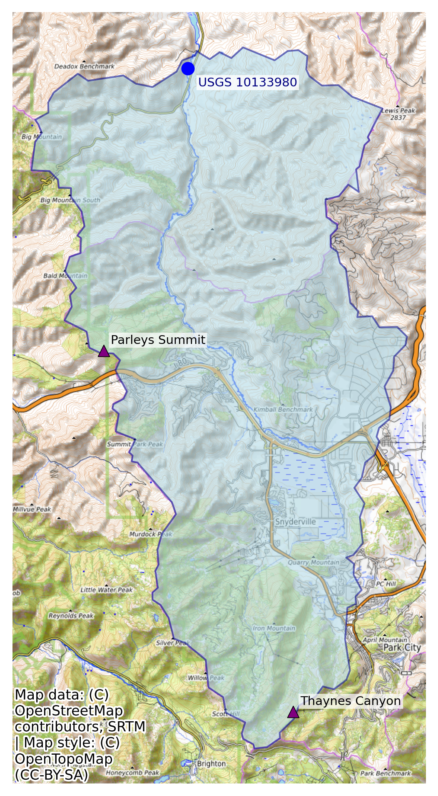

# Hydroinformatics Homework #2

Repo for homework #2: Data Acquisition, Processing, and Communication

For this assignment, reservoir management requests recommendations to balance water storage and mitigate flooding potential for the previous water year on April 1st, 2025, for a reservoir of choice. The sub-basin/reservoir has 2 SNOTEL stations, a USGS streamflow gage near the inlet of the reservoir that is hydrologically relevant to the upstream SNOTEL sites, and no significant reservoir upstream.

## What's Here
This repo includes one Python notebook with the master script: [res_mgmt.ipynb](https://github.com/adernbach/hydroinformaticshomework2/blob/main/res_mgmt.ipynb). Supplemental functions in the master notebook are called from the [supporting folder](https://github.com/adernbach/hydroinformaticshomework2/tree/main/supporting). More functions than necessary are in in those Python files to support further data analysis if needed. The [files folder](https://github.com/adernbach/hydroinformaticshomework2/tree/main/files) includes a folder for SNOTEL data that is downloaded from the NWCC website, East Canyon spatial data, and the processed/cleaned USGS streamflow data. All data are downloaded and saved automatically when the master script is ran. The [images folder](https://github.com/adernbach/hydroinformaticshomework2/tree/main/images) is the location where images and figures are saved when created in the script.
Finally, an [environment file](https://github.com/adernbach/hydroinformaticshomework2/blob/main/hyriver.yml) is included to ensure reproducibility. 

## Site Information
This analysis includes 1 USGS stream gage above a reservoir and 2 SNOTEL sites within the sub-basin:

**USGS site:** \
Site Number: 10133980 \
Site Name: East Canyon Creek AB East Cyn Res NR Morgan, Utah \

**SNOTEL sites:** \
Station ID: 684 \
Site Name: Parley's Summit

Station ID: 814 \
Site Name: Thaynes Canyon

